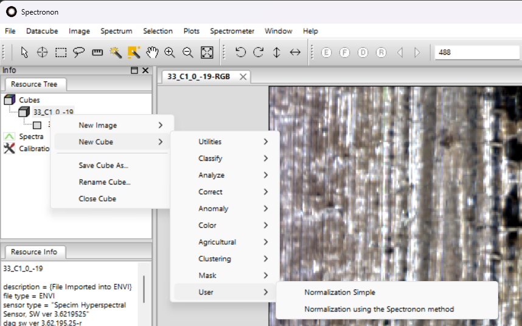
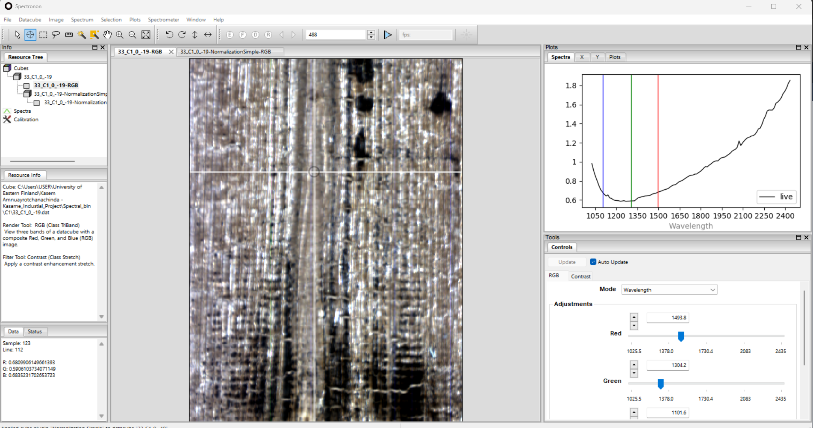
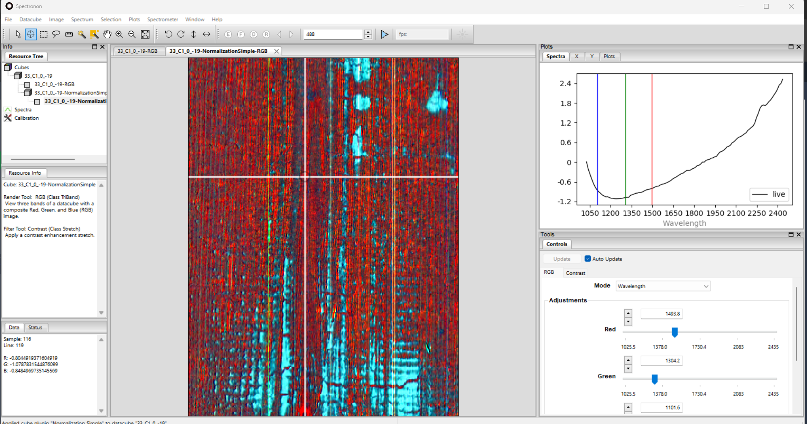
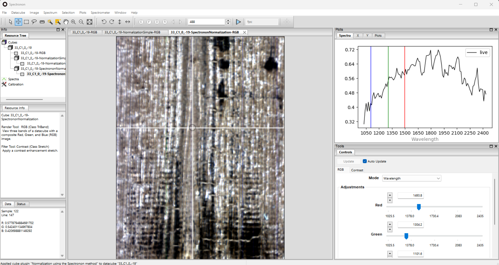

# A plugin for datacube normalization of hyperspectral images in the Spectronon software.

This project focuses on the normalization of hyperspectral image datacubes. Designed for Spectronon software, it streamlines preprocessing by implementing efficient normalization techniques to enhance the analysis and visualization of spectral data.

## Features

- **Normal Standardization**: Applies normal standardization techniques to preprocess hyperspectral image datacubes for consistent analysis.
- **StandardScaler Normalization**: Leverages the StandardScaler method to ensure robust normalization by adjusting the mean and variance across spectral data.

## Installation

### Requirements

- Python 3.10 or higher
- The following Python libraries:
    - `numpy`
    - `Spectronon Software`

### Setup Instructions

1. Clone the repository to your local machine:
   ```bash
   git clone https://github.com/sonainjameel/Industrial_Project_2024.git
   cd Industrial_Project_2024
   ```

2. Copy the files and paste into the Spectronon plugin directory:
   ```bash
   C :\Users\<UserName>\AppData\Local\SpectrononPro3\user_plugins\cube\user\
   ```
3. After adding the files to the directory go to Spectronon software and select ```Reload Plugins``` from Spectronon’s file menu, Spectronon will add
the custom analysis plugin to its menu system.

## Usage

To use the plugins, load the datacute (hyperspectral image) and follow these steps:

### Step 1: Plugin options


### Step 2:


### Step 3:


### Step 4:



## Contributing

Contributions are welcome! Please follow these steps:

1. Fork the repository.
2. Create a new branch for your feature or bug fix.
3. Commit your changes with clear descriptions.
4. Submit a pull request for review.

## License

This project is licensed under the MIT License.

## Acknowledgements

Group A (Sonain, Kasem, and Turab) especially thanks Joni Hyttinen and Prof. Markku Keinänen for their support in developing this project.
